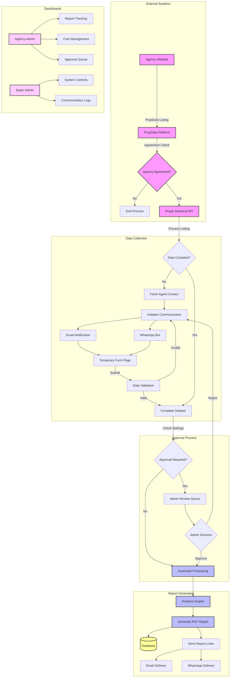

# PropData Integration Documentation

## Overview

The PropData integration is a comprehensive property intelligence automation system that monitors real estate agent property uploads and generates enhanced property analysis reports. This system bridges the gap between agent property listings and data-driven investment intelligence.

## Purpose & Business Value

### Core Objective
Automatically detect when real estate agents upload new properties to their PropData-powered websites and transform basic listing data into comprehensive property intelligence reports that are automatically delivered to agents.

### Business Value Proposition
- **Automated Intelligence**: Convert basic property listings into detailed market analysis reports
- **Agent Productivity**: Eliminate manual report generation for agents
- **Data Enhancement**: Enrich basic listing data with additional market intelligence datasets
- **Professional Delivery**: Automated distribution via email and WhatsApp
- **Revenue Generation**: Monetize property intelligence as a value-added service

## System Architecture

### Data Flow Overview



## Technical Implementation

### Current Implementation Status

#### ✅ Completed Components

**PropData API Integration**
- Authentication with PropData staging environment
- Incremental and full synchronization capabilities
- Duplicate prevention using PropData IDs
- Active property filtering (excludes archived/sold listings)
- Comprehensive data extraction including:
  - Property details (price, type, bedrooms, bathrooms)
  - Location data (address, suburb, province)
  - Property sizes (floor area, land size)
  - Agent contact information
  - Actual listing dates (mandate start dates)

**Database Schema**
```sql
-- PropData listings table
CREATE TABLE propdata_listings (
  id SERIAL PRIMARY KEY,
  propdata_id TEXT UNIQUE NOT NULL,
  agency_id INTEGER NOT NULL,
  status TEXT NOT NULL,
  listing_data JSONB NOT NULL,
  address TEXT NOT NULL,
  price DECIMAL(12,2) NOT NULL,
  property_type TEXT NOT NULL,
  bedrooms DECIMAL(3,1) NOT NULL,
  bathrooms DECIMAL(3,1) NOT NULL,
  parking_spaces INTEGER,
  floor_size INTEGER,
  land_size INTEGER,
  location JSONB,
  features JSONB,
  images JSONB,
  agent_id TEXT,
  agent_phone TEXT,
  listing_date TIMESTAMP,
  last_modified TIMESTAMP NOT NULL,
  created_at TIMESTAMP DEFAULT NOW() NOT NULL,
  updated_at TIMESTAMP DEFAULT NOW() NOT NULL
);
```

**Frontend Interface**
- Admin dashboard for PropData listings management
- Real-time property data display with authentic pricing
- Manual and automated sync capabilities
- Property filtering and sorting functionality
- Pagination for large datasets

#### 🚧 In Progress / Required Components

**Automated Scheduling**
- Periodic sync mechanism (currently manual)
- Configurable sync intervals
- Monitoring and alerting for sync failures

**Report Generation Engine**
- Property analysis algorithm integration
- PDF report generation pipeline
- Template management system
- Data enhancement with additional datasets

**Communication System**
- Email notification service
- WhatsApp integration for agent communication
- Temporary form generation for data collection
- Multi-channel delivery coordination

**Approval Workflow**
- Admin review queue implementation
- Automated vs. manual processing logic
- Agency-specific approval settings
- Audit trail and decision tracking

### API Endpoints

#### PropData Listings Management
```typescript
// Fetch all PropData listings
GET /api/propdata/listings
Response: PropdataListing[]

// Synchronize with PropData API
POST /api/propdata/listings/sync
Body: {
  forceFullSync?: boolean,
  maxPages?: number,
  pageSize?: number
}
Response: {
  success: boolean,
  message: string,
  summary: {
    newListings: number,
    updatedListings: number,
    errors: number
  }
}

// Fetch raw PropData API data
GET /api/propdata/fetch-listings
Response: {
  total: number,
  results: PropDataListing[],
  next?: string,
  previous?: string
}
```

### Data Models

#### PropData Listing Interface
```typescript
interface PropdataListing {
  id: number;
  propdataId: string;
  agencyId: number;
  status: string;
  address: string;
  price: number;
  propertyType: string;
  bedrooms: number;
  bathrooms: number;
  parkingSpaces: number | null;
  floorSize: number | null;
  landSize: number | null;
  agentId: string | null;
  agentPhone: string | null;
  listingDate: string | null;
  lastModified: string;
  createdAt: string;
  updatedAt: string;
  images?: string[];
  location?: {
    latitude?: number;
    longitude?: number;
    suburb?: string;
    city?: string;
    province?: string;
  };
  features?: string[];
  listingData?: any; // Raw PropData API response
}
```

## Configuration

### Environment Variables
```bash
# PropData API Configuration
PROPDATA_API_KEY=your_api_key
PROPDATA_BASE_URL=https://staging.api-gw.propdata.net
PROPDATA_USERNAME=your_username
PROPDATA_PASSWORD=your_password

# Database Configuration
DATABASE_URL=your_postgresql_connection_string
```

### PropData API Authentication
The system uses basic authentication with PropData's staging environment:
- Base URL: `https://staging.api-gw.propdata.net`
- Authentication: HTTP Basic Auth with username/password
- Token expiration: 30 minutes
- Automatic token refresh on expiration

## Operational Procedures

### Sync Types

#### Refresh (Frontend Only)
- Reloads current data from local database
- No external API calls
- Instant response
- Use case: Check current display data

#### Quick Sync (Incremental)
- Fetches only properties modified since last sync
- Uses `modified_since` parameter with latest listing timestamp
- Efficient for regular operations
- Typical duration: 10-30 seconds
- Use case: Daily monitoring for new listings

#### Full Sync (Complete)
- Fetches all properties regardless of modification date
- Processes entire PropData inventory
- Resource intensive operation
- Typical duration: 1-2 minutes
- Use case: Initial setup or data reconciliation

### Data Quality Controls

#### Property Filtering
- Only processes "Active" status properties
- Automatically excludes: Archived, Sold, Valuation, Pending
- Prevents duplicate entries using PropData IDs
- Validates required fields before database insertion

#### Error Handling
- Numeric field overflow protection for luxury properties (>R100M)
- Data type conversion validation
- Comprehensive error logging and reporting
- Graceful degradation on partial failures

## Monitoring & Observability

### Logging Strategy
```typescript
// Sync operation logging
console.log(`PropData sync requested. Force full sync: ${forceFullSync}`);
console.log(`Total listings available: ${response.count}`);
console.log(`New listings added: ${newCount}`);
console.log(`Existing listings updated: ${updatedCount}`);
console.log(`Errors encountered: ${errorCount}`);

// Property filtering logging
console.log(`Skipping ${listing.status} property: ${listing.id}`);

// Data quality logging
console.log('Price-related fields:', priceFields);
console.log('Date-related fields:', dateFields);
```

### Key Metrics
- Sync success/failure rates
- Processing time per sync operation
- Property status distribution
- Data completeness percentages
- Error categorization and frequency

## Future Enhancements

### Phase 1: Automation
- Scheduled sync operations (cron-based)
- Real-time webhook integration with PropData
- Automated failure recovery and retry logic

### Phase 2: Intelligence
- Property analysis algorithm integration
- Market data enhancement from additional sources
- Automated valuation models
- Investment scoring algorithms

### Phase 3: Communication
- Email template engine
- WhatsApp Business API integration
- SMS fallback capabilities
- Multi-language support

### Phase 4: Analytics
- Agent engagement tracking
- Report delivery analytics
- Market trend analysis
- Performance dashboard enhancements

## Troubleshooting

### Common Issues

#### Authentication Failures
```bash
# Check credentials
curl -u "$PROPDATA_USERNAME:$PROPDATA_PASSWORD" \
  "https://staging.api-gw.propdata.net/listings/api/v1/residential?limit=1"
```

#### Database Connection Issues
```bash
# Test database connectivity
psql $DATABASE_URL -c "SELECT COUNT(*) FROM propdata_listings;"
```

#### Sync Performance Issues
- Monitor sync duration trends
- Check PropData API response times
- Review database query performance
- Implement pagination optimization

### Error Resolution

#### Numeric Field Overflow
- Indicates property price exceeds database precision
- Solution: Increase price field precision in schema
- Current limit: R 9,999,999,999.99 (12 digits, 2 decimal places)

#### Duplicate Key Violations
- Indicates PropData ID collision
- Solution: Check PropData ID extraction logic
- Verify unique constraint implementation

## Security Considerations

### API Security
- PropData credentials stored in environment variables
- No API keys exposed in client-side code
- Rate limiting compliance with PropData terms

### Data Privacy
- Agent contact information handling
- GDPR compliance for European agents
- Data retention policies
- Secure transmission of reports

### Access Control
- Admin-only access to PropData integration
- Role-based permissions for sync operations
- Audit logging for all administrative actions

## Conclusion

The PropData integration represents the foundational layer of an automated property intelligence system. Current implementation successfully handles data ingestion and management, with future phases focusing on intelligence generation, automated communication, and advanced analytics capabilities.

This system transforms basic property listings into valuable market intelligence, positioning Proply as a comprehensive property analysis platform for real estate professionals.